# PtychoNet: Fast and High Quality Phase Retrieval for Ptychography

Ziqiao Guan1 ziguan@cs.stonybrook.edu Esther H. R. Tsai2 etsai@bnl.gov Xiaojing Huang3 xjhuang@bnl.gov Kevin G. Yager2 kyager@bnl.gov Hong Qin1 qin@cs.stonybrook.edu

1Department of Computer Science Stony Brook University Stony Brook, NY 11794, USA 2Center for Functional Nanomaterials Brookhaven National Laboratory Upton, NY 11973, USA 3National Synchrotron Light Source II Brookhaven National Laboratory Upton, NY 11973, USA

## Abstract

Ptychography is a coherent diffractive imaging method that captures multiple diffraction patterns of a sample with a set of shifted localized illuminations ("probes"). The reconstruction problem, known as “phase retrieval”, is typically solved by iterative algorithms. In this paper, we propose PtychoNet, a deep learning based method to perform phase retrieval for ptychography in a non-iterative manner. We devise a generative network to encode a full ptychography scan, reverse the diffractions at each scanning point and compute the amplitude and phase of the object. We demonstrate successful reconstructions using PtychoNet as well as recovering fine features in the case of extreme sparse scanning where conventional iterative methods fail to give recognizable features.

## 1 Introduction

Coherent diffractive imaging (CDI) is a technique of measuring the scattering from an object illuminated by a coherent beam, e.g. laser light or X-ray. For CDI, the analysis of the object relies on a reconstruction algorithm to recover the object structure based on the measured diffraction pattern. However, the reconstruction problem is generally ill-posed, because the intensity of a diffraction pattern is captured on the detector while the phase information is lost. Phase retrieval methods are thus developed to recover both the amplitude and phase of the object of interest [1].

Among the CDI methods, ptychography offers the advantage of imaging large objects with high resolution. The method captures multiple diffraction patterns of an object with a set of shifted localized illuminations [8, 9]. The overlap of the illuminations provides redundancy for robust reconstruction of the object with a resolution that is not limited by the probe size nor the scanning step size but the highest detectable scattering angle. X-ray ptychography allows for the reconstruction of object structures on the nanometer scale in 3D [8], practical for studies in e.g. biology, geology, and material science. Electron ptychography provides sub-angstrom resolution for 2D materials [9] and optical ptychography allows the imaging of large and thick samples with 3D isotropic micron-resolution [10, 11].

Challenges of ptychography reside in its long data acquisition time and the computational complexity in data processing. The scanning nature of the method is advantageous for imaging extended field of views of an object, however, at the cost of long experimental time and the increased likelihood of serious radiation damage of the sample. For X-ray imaging, it is predictable that with synchrotron upgrades, the coherent photon flux will increase by a few orders of magnitude, presenting a great computational challenge to reconstruction algorithms if corresponding increase in acquisition speed is also achieved with upgraded instrumentation. Therefore, sparse scanning schemes and fast reconstruction algorithms will bring immediate benefits to experiments, including high-throughput and low-dose imaging, as well as provide a solution to the elevated computational demand in the near future. In this work, we introduce a new ptychographic reconstruction method based on machine learning, presenting a possible direction to overcome the challenges.

### 1.1 Formulation

In CDI, an object of interest is shone by a light source and the incident wave is diffracted by object structure. On the far-field detector, this results in a Fourier transform

$$
I = |\mathcal{F}(\psi)|^2,
$$

where \\( \\psi \\) is the exit wave of the object. In ptychography, the illumination (\"probe\") is shifted laterally to generate multiple views of the object:

$$
I_j(\mathbf{q}) = |\mathcal{F}[P(\mathbf{r} - \mathbf{r}_j)O(\mathbf{r})]|^2,
$$

where \\( \\mathbf{q} \\) is the coordinate in the reciprocal space, \\( \\mathbf{r} \\) is in real space, \\( \\mathbf{r}_j \\) is the probe position, \\( P \\) is the probe and \\( O \\) is the object. The reconstruction problem, from diffraction images to real space, is called \"phase retrieval\" because the far-field detector only captures the intensity, given by Eq. (1), and the reconstruction is essentially recovering the phase. Traditional methods of reconstruction are based on iteration to satisfy the real space and Fourier constraints alternately [8]. These methods normally take a few hundred iterations to converge.

We presented PtychoNet, a deep learning based method to perform phase retrieval for ptychography. PtychoNet reverses the diffractions at each scanning point, and then merges them to generate the amplitude and phase of the original object. Using PtychoNet, we are able to compute phase retrieval in only one forward pass without any iterations.

### 1.2 Contributions

Our contributions in this paper are mainly as follows:

- We describe the first non-iterative, end-to-end method to solve the phase retrieval problem for real-space ptychography without limitation on scanning patterns.
- We presented a successful demonstration of PtychoNet through simulations and show its robustness under extreme low overlap conditions when conventional methods failed.
- By using PtychoNet output to initialize iterative algorithms, we show that reconstruction of fine features is made possible for a dataset with almost no overlap, which is not achievable previously. This new finding urges the re-examination of the ptychography overlap conditions and expands the potential of ptychography.

## 2 Related Works

Generative deep learning. Convolutional neural networks (CNNs) [24, 25] for image synthesis have seen remarkable progress among recent successful applications. Early methods such as variational autoencoder [26] have some success but often suffer from blurry images. Auto-regressive models like PixelCNN [27, 28, 29] compute each pixel progressively using a probability model, which is efficient but struggles to generate larger images. In order to generate sharp and detailed images, researchers use convolution transpose (“deconvolution”) to build deep neural networks that enable high-resolution upsampling, notably in image segmentation [30, 31]. Generative Adversarial Networks (GANs) [32, 33, 34] train a pair of generator network and discriminator network as adversaries and drastically improve the quality of generated samples.

Ptychography and related techniques. Ptychography [8, 35] is a lensless coherent diffractive imaging method that utilizes redundancy for high resolution. For 3D objects, ptychographic X-ray computed tomography (PXCT) offers quantitative electron density and absorption tomograms with nanoscopic resolution [8, 8, 13]. Electron ptychography [4] and optical ptychography [29, 33] also provide high-resolution in their respective imaging regimes. On the other hand, Fourier ptychography microscopy (FPM) [3] generates high-resolution image by combining a collection of images with different illumination angles. Fourier ptychographic tomography (FPT) [14] at the optical regime shows reconstruction of 3D object at sub-micron resolution.

Ptychographic reconstruction methods. Conventional reconstruction methods for ptychography are based on iterative phase retrieval algorithms [8], e.g. PIE [8, 35], ePIE [3], difference map (DM) [8, 29] and maximum likelihood [29, 30]. Recently automatic differentiation is employed to solve phase retrieval with more straightforward formulations and better parallelization support [10, 13, 34]. There are also closed form formulations using Wigner-distribution deconvolution (WDD) [4], but WDD is highly susceptible to noise. Recently, techniques such as iterative refinement [8] and low-rank matrix completion [46] are adopted to suppress the noise, achieving comparable results with aforementioned well-established methods.

Machine learning reconstruction methods. Machine learning is revolutionizing reconstruction algorithms. Paine and Fienup propose to compute smart initial guesses for phase retrieval using CNNs [38]. At present, there is a lack of machine learning applications in the standard real-space ptychography, but there have been demonstrations of machine learning in FPM. PtychNet [21] and cGAN-FP [8] use CNNs to reconstruct FPM on simulation datasets, and [55, 56, 57] extend CNN-based methods to sequential FPM and test on real experimental data. In general, CNN generative methods work well with a wide range of imaging setups, e.g. optical microscopy [4], limited-angle tomography [10], holography [3], imaging through scattering media [50], nonlinear electromagnetic inverse scattering [2] and imaging of phase-only objects [3]. However to our knowledge, there has been no demonstration of ptychographic reconstruction based on diffraction patterns using machine learning.

## 3 Notation

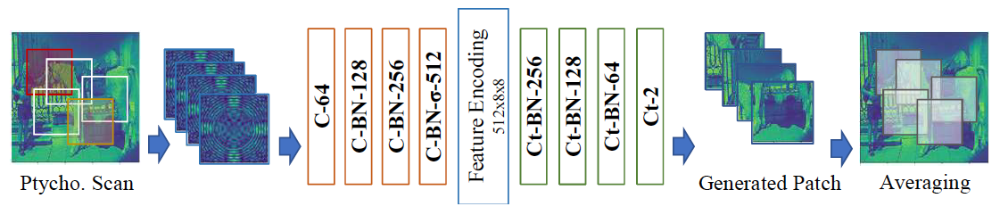

**Figure 1:** Architecture of PtychoNet. In the network: C - convolution, size 4x4, stride 2; Ct - convolution transpose, size 4x4, stride 2; BN - batch normalization; σ - sigmoid. Activation functions in the encoder is LeakyReLU, α = 0.2; ReLU in the decoder.

---

**ALGORITHM 1:** Reconstruction using PtychoNet.

**Input:** Full scan $\mathbf{A} \in \mathbb{R}^{N \times h \times w}$, scan layout $\mathbf{M} \in \mathbb{Z}^{N \times 4}$.

**Output:** Object image $\mathbf{Y} \in \mathbb{R}^{2 \times H \times W}$.

1: $\mathbf{Y} = \mathbf{K} = 0^{2 \times H \times W}$;

2: **for** *each diffraction image* $\mathbf{A}_j$ *in parallel* **do**

3: $\quad$ Compute the corresponding object patch $\mathbf{Y}_j$ in real space with input $\mathbf{A}_j$;

4: $\quad$ $\mathbf{M}_j(\mathbf{Y}) = \mathbf{M}_j(\mathbf{Y}) + \mathbf{Y}_j$;

5: $\quad$ $\mathbf{M}_j(\mathbf{K}) = \mathbf{M}_j(\mathbf{K}) + 1$;

6: **end**

7: $\mathbf{Y} = \mathbf{Y} / \max(\mathbf{K}, 1)$;

---

We first describe the ptychographic imaging and reconstruction in discretized pixel space. We define the object \\( \\mathbf{O} \\) as a complex-valued \\( H \\times W \\) image, and the size of probe \\( \\mathbf{P} \\) is \\( h \\times w \\). With \\( \\mathbf{P} \\) fixed, the full ptychographic scan is determined by a set of \\( N \\) probe positions, e.g. rectangular mesh pattern, concentric pattern or Fermat spiral pattern [27]. For convenience to describe algorithms, we can store all the scanning positions by recording the top, bottom, left, and right pixels \\([t, b, l, r]\\) in a layout matrix \\( \\mathbf{M} \\in \\mathbb{Z}^{N \\times 4} \\). With an abuse of notation, we define the projection operator

$$
\mathbf{M}_j(\mathbf{O}) = \mathbf{O}[\mathbf{M}[j,0]:\mathbf{M}[j,1], \mathbf{M}[j,2]:\mathbf{M}[j,3]]
$$

to acquire the valid range of the diffraction image at scanning position $j$, and (2) becomes

$$
\mathbf{I}_j = \frac{1}{hw} \| \mathrm{DFT}[\mathbf{P} \cdot \mathbf{M}_j(\mathbf{O})] \|^2,
$$

where $1/hw$ is a normalization factor for Discrete Fourier Transform (DFT). What the detector actually captures is the phase-less intensity $\mathbf{I}_j \in \mathbb{R}_+^{h \times w}$. For phase retrieval, we directly use the amplitude $\mathbf{A}_j = \sqrt{\mathbf{I}_j}$ instead of $\mathbf{I}_j$. We stack up all $\mathbf{A}_j$ in a new dimension to form $\mathbf{A}(\mathbf{O}; \mathbf{P}, \mathbf{M}) = [\mathbf{A}_1, \mathbf{A}_2, \ldots, \mathbf{A}_N] \in \mathbb{R}_+^{N \times h \times w}$ and define it as a ptychography or a "full scan" of the input object $\mathbf{O}$ under probe $\mathbf{P}$ and layout $\mathbf{M}$.

## 4 PtychoNet

PtychoNet is a convolutional encoder-decoder network to compute real space images from ptychographic scans (architecture shown in Figure 1). In order to solve such an inverse problem, we try to exploit every image and meanwhile enforce consistency in overlapping regions. For that purpose, our strategy is to reconstruct every single one of the images, and then stitch the local patches later according to their spatial relations.

The input of the network is a full scan \\( \\mathbf{A} \\), with known layout \\( \\mathbf{M} \\). The encoder side encodes each diffraction image \\( \\mathbf{A}_j = \\mathbf{A}[j,:,:] \\) individually and the decoder side computes their corresponding object patches \\( \\mathbf{Y}_j \\). Here we represent the patches using their amplitude and phase, \\( \\mathbf{Y}_j \\in \\mathbb{R}^{2 \\times h \\times w} \\). For the final output, we initialize an all-zero output matrix \\( \\mathbf{Y} \\in \\mathbb{R}^{2 \\times H \\times W} \\) and a counter matrix \\( \\mathbf{K} \\in \\mathbb{Z}^{2 \\times H \\times W} \\). We add each \\( \\mathbf{Y}_j \\) to \\( \\mathbf{Y} \\) and increase the counter \\( \\mathbf{K} \\) on the its scanning position. Finally we average the sums of all the output patches to compute the full object. The complete reconstruction is described in Algorithm 1.

For the loss to minimize during training, it is feasible to include terms such as pixelwise loss, perceptual loss [10] and adversarial loss [11]. Here we propose two losses. The first is a plain mean square error (MSE)

$$
\mathcal{L}_1(\mathbf{Y}, \mathbf{O}) = \mathcal{L}_{\text{MSE}}(\mathbf{Y}, \mathbf{O}) = \frac{1}{HW} \| \mathbf{Y} - \mathbf{O} \|^2.
$$

Apart from measuring the difference in the real space, we can also constrain the reciprocal space. Imagine we perform ptychography on the output $\mathbf{Y}$ instead of the real object, we shall also obtain a ptychographic scan pattern that is close to the input $\mathbf{A}$. Using (4), we can compute the MSE of computed and true diffractions, simply called DFT loss

$$
\mathcal{L}_{\text{DFT}}(\mathbf{Y}, \mathbf{O}; \mathbf{A}, \mathbf{P}, \mathbf{M}) = \frac{1}{Nhw} \sum_{j=0}^N \left\| \frac{1}{\sqrt{hw}} \| \text{DFT}[\mathbf{P} \cdot \mathbf{M}_j(\mathbf{Y})] \| - \mathbf{A}_j \right\|^2,
$$

and thus we propose the dual space error (DSE)

$$
\mathcal{L}_2(\mathbf{Y}, \mathbf{O}; \mathbf{A}, \mathbf{P}, \mathbf{M}) = \mathcal{L}_{\text{MSE}} + \lambda \mathcal{L}_{\text{DFT}}.
$$

In our experiment, $\lambda = 1$.

## 5 Experiments

### 5.1 Implementation Details

We generated a simulation dataset for training using Caltech-256 Object Category Dataset [13]. To construct a real space “object”, we paired two images from the dataset, one as amplitude map and one as phase. The amplitude was scaled and shifted to [0.5, 1] and the phase was in \\([-\\pi/3, 0]\\). We split these images into two disjoint sets, from which we generated 2,000 training objects and 100 test objects respectively. We generated a fixed probe of size \\(128 \\times 128\\) and performed ptychography scans on all images using Fermat spiral pattern [12], shown in Figure 2. In our resolution settings, our images were resized to \\(478 \\times 480\\) to cover the scanning trajectory and 354 diffraction images were computed during a complete scan. We used Adam optimizer [10] to train PtychoNet with a learning rate of 0.0002 and \\( \\beta_1 = 0.5 \\).

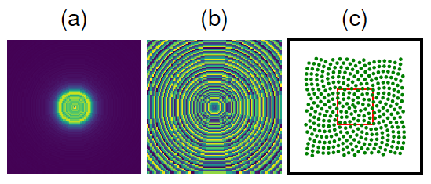

**Figure 2:** Probe and scan layout. (a) probe amplitude; (b) probe phase; (c) layout of Fermat spiral pattern. Green dots show the centers of every scanning position and red rectangle shows the size of the probe w.r.t. object.

|          | (a) | (b) | (c) | (d) |
|----------|-----|-----|-----|-----|
| Amp. | 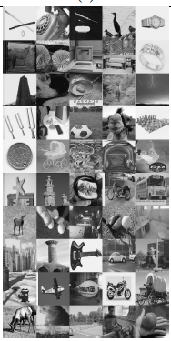 | 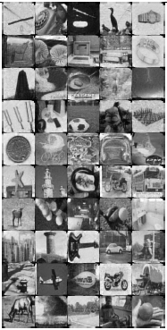 | 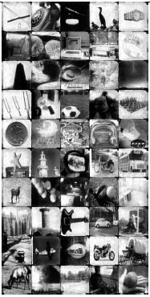 | 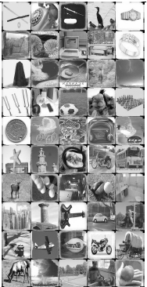 |
| Phase. | 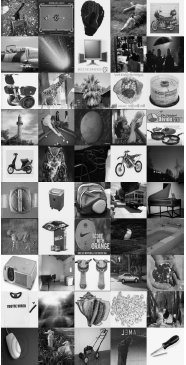 | 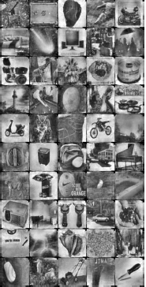 | 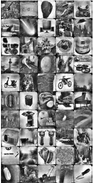 | 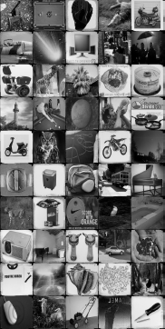 |
| Mean PSNR | – | 15.60 | 14.55 | 14.39 |
| Mean SSIM | – | 0.7496 | 0.7154 | 0.8864 |

**Table 1**: Training and reconstruction on Caltech-256. (a) Ground truth. (b) PtychoNet (MSE). (c) PtychoNet (DSE). (d) Difference map.

|       | (a) | (b) | (c) |
|-------|-----|-----|-----|
| Phase | 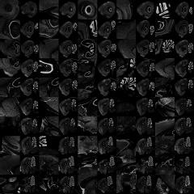  | 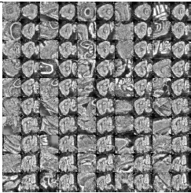   | 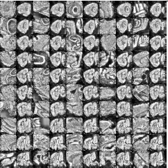  |

**Table 2**: Reconstruction on BrainMaps dataset using a Caltech-256 trained PtychoNet. (a) Ground truth. (b) PtychoNet (MSE). (c) PtychoNet (DSE).

### 5.2 Comparison with Iterative Algorithms

We compared the reconstruction of PtychoNet with difference map (DM) method. For PtychoNet, we trained the network using MSE (5) and DSE (7) separately. For DM, the initial object $\mathbf{O}_g$ was random, and the initial probe was the actual probe $\mathbf{P}_g = \mathbf{P}$. 300 iterations were applied. Reconstruction results are shown in Table 1.

The probe is handled differently in PtychoNet and in iterative algorithms. In our dataset, the probe was fixed and it was directly provided to DM as initial value. This is crucial for the algorithm to converge, as the probe is a common factor in all the diffractions. It is advised to provide a reasonable approximation of the probe as well as a spatial support of the probe to ensure that the iterative algorithm converges to an optimal solution. In PtychoNet with MSE, however, the probe was not explicitly given in either training or testing and it was learned from data. There was no explicit formulation of a matrix $\mathbf{P}$ and PtychoNet learned to directly reverse the diffraction patterns in Fourier space to the real space object.

On the other hand, DSE utilized the known probe $\mathbf{P}$. Comparing Table 1(b) and (c), we can see that the DFT loss in (c) corrected the contrast in some of the images, because MSE alone tends to push the pixel output to a mean value, causing the image to look gray and bland overall, and Fourier constraint alleviated this problem. The parameter $\lambda$ can be tuned to adjust this correction.

### 5.3 Tests on BrainMaps Image Dataset

We also demonstrate here some success in transferring the model learned on natural images to optical micrograph of biological samples. Biological specimen often presents hierarchical structures and thus a broad spatial spectrum. Using PtychoNet trained with Caltech-256 (Section 5.1), we computed phase retrieval on BrainMaps [1], a biological microscopic image set. We selected 50 full images and 50 cropped image patches (see Table 2(a)) from Dataset 107\footnote{http://brainmaps.org/index.php?action=viewslides&datid=107} to generate 100 real space objects. For each object, one image was used for phase, scaled and shifted to $[0.5, 1]$, and amplitude was set to constant 0.5. The same probe from Section 5.1 was used to perform ptychography. The results are shown in Table 2. We can see that even though the contrast and fine details were not perfect, because it was trained on a different dataset, PtychoNet was still able to capture the structure of the images. This cross-modality result shows the great potential for modeling more imaging setups and materials of interest.

### 5.4 Performance with Low Overlap

|          | (a) | (b) | (c) |
|----------|-----|-----|-----|
| Amp. | 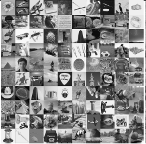 | 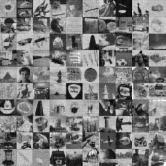 | 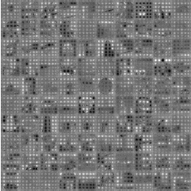 |
| Phase. |  | 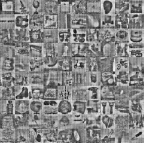 | 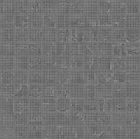 |
| Mean PSNR | – | 15.61 | 9.507 |
| Mean SSIM | – | 0.7228 | 0.1633 |

**Table 3**: Comparison of reconstructions with low overlap using Caltech-256. (a) Ground
truth. (b) PtychoNet (MSE). (c) DM with known probe.

Experimentally the current bottleneck of ptychography is often the data acquisition time and the amount of dose deposited on sample. Sparse sampling with useful resolution can dramatically increase the imaging throughput as well as enable imaging of radiation-sensitive materials or the study of in-situ dynamics. Here we compare the results of PtychoNet and DM with known probe when the overlap constraint was severely weakened by a sparse scan. We reduced a 400-point mesh pattern to 25 points, shown in Figure 4. We plotted all the scanning positions and a few probe windows to show the overlap size. All small light green and big dark green dots together give the 400 center positions for scanning points. With this dense scan, the adjacent points are 17 pixels apart, giving an 87% overlap between adjacent probe windows. Using all 400 points gives a fairly good overlap, so we can expect to have a clean reconstruction similar to Table 1. The sparse case is only using the 25 big dark green dots. This reduces the overlap to 34%. Considering the probe is almost zero outside the central disk, which is essentially the spatial extent of the illumination, the overlap is estimated to be around 60% in diameter for the 400-points and 0% for the sparse 25-points. The reconstructions are shown in Table 3. We can see the iterative algorithm failed to converge because there was barely any overlap to constrain the object $\mathbf{O}$, but PtychoNet managed to learn the inverse problem from data and still produced a reasonable estimate. Such dramatic reduction in the scanning sampling, a factor of 1/16 in this initial demonstration, shows that PtychoNet could be a powerful method to overcome the aforementioned bottleneck.

## 6 Extreme Low Overlap Reconstruction with PtychoNet Initialization

|          | (a) | (b) | (c) |
|----------|-----|-----|-----|
| Amp. | 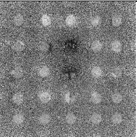 | 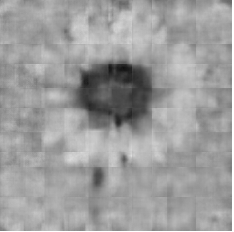 | 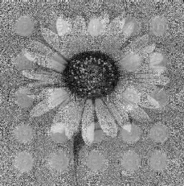 |
| Phase. | 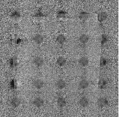 | 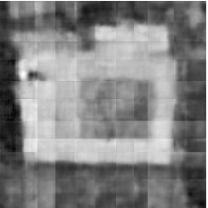 | 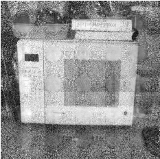 |

**Table 4**: Comparison of reconstructions with low overlap using Caltech-256. (a) DM, object initialized randomly. (b) PtychoNet output. (c) DM, object initialized by PtychoNet.

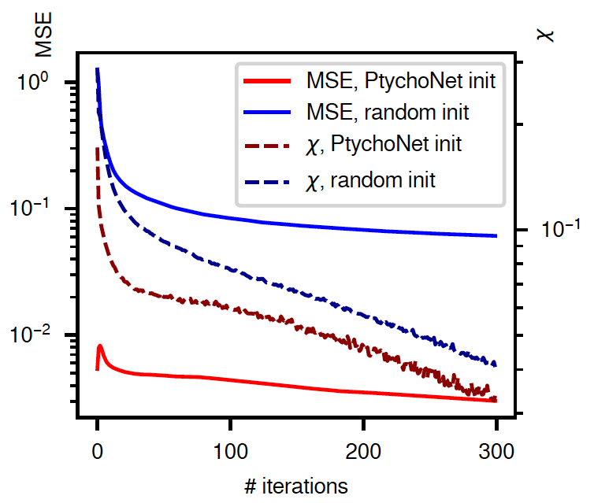

**Figure 3**: Comparison of iterative descent using PtychoNet and random initializations.

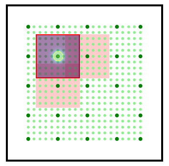

**Figure 4**: Scanning layout for high and low overlaps.

PtychoNet is a non-iterative method for phase retrieval where the output is produced with deterministic number of operations, different from an iterative approach where hundreds of iterations are taken before a chosen stopping criterion is met. However, PtychoNet as a deep neural network essentially acts as a deep approximator learned from data. Even though it is capable of producing plausible, close-to-real results, it cannot be quantitatively accurate for all samples and it is prone to shifts in data distributions when working with new data. Iterative algorithms, on the other hand, are good at refining the output steadily under proper conditions.

For iterative algorithms, a good initialization is especially crucial for data with low overlap. Here we demonstrate a case where using PtychoNet as a good initial guess for iterative algorithms is actually necessary to reconstruct fine features. In the low overlap scenario shown in Section 5.4, both PtychoNet and DM reconstructions suffered from varying degrees of degradation. We compare two initializations of the object using the DM method: one is random, and the other is the PtychoNet (MSE) output. The test object is taken from Table 3(a) (0,0). Three hundred iterations were applied and the reconstructions are shown in Table 4. We report the MSE and the error measured by the normalized update size $\chi(t) = \sqrt{\sum \|O(t) - O(t-1)\|^2} / \sqrt{\sum \|O(t)\|^2}$ in Figure 3. We can see that PtychoNet provided a good reconstruction of low spatial frequency components and thus, with the PtychoNet initialization, the starting error was significantly lower than that of random initialization. The final reconstruction (c) was much better than what PtychoNet and DM alone could achieve. This shows that under adverse conditions (low overlap), machine learning with iterative refinement is a great combination for dramatic enhancement in reconstruction quality. Based on these results, it can be concluded that PtychoNet by itself and PtychoNet-DM essentially appeals for re-examination of the overlap requirement for ptychography [4] as well as offers great potential for studies to be performed in regimes previously deemed impossible due to the limited temporal and spatial resolution achievable in experiments.

7 Conclusions

In this paper we presented PtychoNet, an non-iterative end-to-end method for ptychographic reconstruction. We have demonstrated successful reconstructions using the method and presented cross-modality result, from the model trained with Caltech-256 and transferred to biological samples, giving confidence in the broad applicability of PtychoNet. We have also shown that the number of scanning positions can be reduced by over an order of magnitude while the reconstruction still approximates the ground truth. On the contrary, using DM by itself with this sparse scanning pattern gives reconstructions with almost no recognizable features. Moreover, when using PytchoNet result as an initial guess for iterative algorithms, high spatial frequency components and fine features are successfully reconstructed, which to our knowledge was not achieved before for dataset with such a sparse scanning. This result may lead to the re-assessment of the optimal overlap and true potential of ptychography.

In the future, we will extend PtychoNet to provide robust reconstructions with variable probes. A diverse dataset will be collected with various materials and probes for the deep neural networks to fully exploit. We will continue to explore deeper networks, adversarial learning and non-local feature representations to more effectively model the imaging process and further improve the reconstruction quality.

Acknowledgements. This work was supported by NSF IIS-1715985 and NSF IIS-1812606. The authors would like to thank Stony Brook Research Computing and Cyber-infrastructure, and the Institute for Advanced Computational Science at Stony Brook University for access to the high-performance SeaWulf computing system, which was made possible by a $1.4M National Science Foundation grant (#1531492). This research used resources of the Center for Functional Nanomaterials and the National Synchrotron Light Source II, both of which are U.S. Department of Energy (DOE) Office of Science Facilities operated for the DOE Office of Science by Brookhaven National Laboratory under Contract No. DE-SC0012704.

**References**

[1] Brainmaps: An interactive multiresolution brain atlas. http://brainmaps.org, 2015.
[2] R. Bates and J. Rodenburg. Sub-ångström transmission microscopy: a Fourier transform algorithm for microdiffraction plane intensity information. Ultramicroscopy, 31(3):303–307, 1989.
[3] L. Boominathan, M. Maniparambil, H. Gupta, R. Baburajan, and K. Mitra. Phase retrieval for Fourier Ptychography under varying amount of measurements. In BMVC, 2018.
[4] O. Bunk, M. Dierolf, S. Kynde, I. Johnson, O. Marti, and F. Pfeiffer. Influence of the overlap parameter on the convergence of the ptychographical iterative engine. Ultramicroscopy, 108(5):481–487, 2008.
[5] A. Diaz, P. Trtik, M. Guizar-Sicairos, A. Menzel, P. Thibault, and O. Bunk. Quantitative x-ray phase nanotomography. Phys. Rev. B, 85(2):020104, 2012.
[6] M. Dierolf, A. Menzel, P. Thibault, P. Schneider, C. M. Kewish, R. Wepf, O. Bunk, and F. Pfeiffer. Ptychographic X-ray computed tomography at the nanoscale. Nature, 467(7314):436, 2010.
[7] A. Dosovitskiy and T. Brox. Generating images with perceptual similarity metrics based on deep networks. In NeurIPS, pages 658–666, 2016.
[8] H. Faulkner and J. Rodenburg. Movable aperture lensless transmission microscopy: a novel phase retrieval algorithm. Phys. Rev. Lett., 93(2):023903, 2004.
[9] J. R. Fienup. Phase retrieval algorithms: a comparison. Appl. Opt., 21(15):2758–2769, 1982.
[10] S. Ghosh, Y. S. Nashed, O. Cossairt, and A. Katsaggelos. ADP: Automatic differentiation ptychography. In 2018 IEEE International Conference on Computational Photography (ICCP), pages 1–10. IEEE, 2018.
[11] I. Goodfellow, J. Pouget-Abadie, M. Mirza, B. Xu, D. Warde-Farley, S. Ozair, A. Courville, and Y. Bengio. Generative adversarial nets. In NeurIPS, pages 2672–2680, 2014.
[12] A. Goy, G. Roghoobur, S. Li, K. Arthur, A. I. Akinwande, and G. Barbastathis. High-resolution limited-angle phase tomography of dense layered objects using deep neural networks. arXiv preprint arXiv:1812.07380, 2018.
[13] G. Griffin, A. Holub, and P. Perona. Caltech-256 object category dataset. 2007.
[14] M. Guizar-Sicairos and J. R. Fienup. Phase retrieval with transverse translation diversity: a nonlinear optimization approach. Opt. Express, 16(10):7264–7278, 2008.
[15] M. Holler, M. Guizar-Sicairos, E. H. R. Tsai, R. Dinapoli, E. Müller, O. Bunk, J. Raabe, and G. Aeppli. High-resolution non-destructive three-dimensional imaging of integrated circuits. Nature, 543(7645):402, 2017.
[16] R. Horstmyer, J. Chung, X. Ou, G. Zheng, and C. Yang. Diffraction tomography with Fourier ptychography. Optica, 3(8):827–835, 2016.
[17] X. Huang, H. Yan, R. Harder, Y. Hwu, I. K. Robinson, and Y. S. Chu. Optimization of overlap uniformness for ptychography. Opt. Express, 22(10):12634–12644, 2014.
[18] P. Isola, J.-Y. Zhu, T. Zhou, and A. A. Efros. Image-to-image translation with conditional adversarial networks. In CVPR, pages 1125–1134, 2017.
[19] S. Jiang, K. Guo, J. Liao, and G. Zheng. Solving Fourier ptychographic imaging problems via neural network modeling and TensorFlow. Biomedical Opt. Express, 9(7):3306–3319, 2018.
[20] Y. Jiang, Z. Chen, Y. Han, P. Deb, H. Gao, S. Xie, P. Purohit, M. W. Tate, J. Park, S. M. Gruner, et al. Electron ptychography of 2D materials to deep sub-ångström resolution. Nature, 559(7714):343, 2018.
[21] A. Kappeler, S. Ghosh, J. Holloway, O. Cossairt, and A. Katsaggelos. PtychNet: CNN based Fourier ptychography. In 2017 IEEE International Conference on Image Processing (ICIP), pages 1712–1716. IEEE, 2017.
[22] D. P. Kingma and J. Ba. Adam: A method for stochastic optimization. arXiv preprint arXiv:1412.6980, 2014.
[23] D. P. Kingma and M. Welling. Auto-encoding variational bayes. arXiv preprint arXiv:1312.6114, 2013.
[24] A. Krizhevsky, I. Sutskever, and G. E. Hinton. Imagenet classification with deep convolutional neural networks. In NeurIPS, pages 1097–1105, 2012.
[25] Y. LeCun, B. E. Boser, J. S. Denker, D. Henderson, R. E. Howard, W. E. Hubbard, and L. D. Jackel. Handwritten digit recognition with a back-propagation network. In NeurIPS, pages 396–404, 1990.
[26] J. Lee and G. Barbastathis. Denoised wigner distribution deconvolution via low-rank matrix completion. Opt. Express, 24(18):20069–20079, 2016.
[27] L. Li, L. G. Wang, F. L. Teixeira, C. Liu, A. Nehorai, and T. J. Cui. DeepNIS: Deep Neural Network for Nonlinear Electromagnetic Inverse Scattering. IEEE Transactions on Antennas and Propagation, 67(3):1819–1825, 2019.
[28] P. Li, T. B. Edo, and J. M. Rodenburg. Ptychographic inversion via wigner distribution deconvolution: Noise suppression and probe design. Ultramicroscopy, 147:106–113, 2014.
[29] P. Li and A. Maiden. Multi-slice ptychographic tomography. Sci. Rep., 8(1):2049, 2018.
[30] Y. Li, Y. Xue, and L. Tian. Deep speckle correlation: a deep learning approach toward scalable imaging through scattering media. Optica, 5(10):1181–1190, 2018.
[31] J. Long, E. Shelhamer, and T. Darrell. Fully convolutional networks for semantic segmentation. In CVPR, pages 3431–3440, 2015.
[32] A. M. Maiden and J. M. Rodenburg. An improved ptychographical phase retrieval algorithm for diffractive imaging. Ultramicroscopy, 109(10):1256–1262, 2009.
[33] A. M. Maiden, J. M. Rodenburg, and M. J. Humphry. Optical ptychography: a practical implementation with useful resolution. Opt. Lett., 35(15):2585–2587, 2010.
[34] Y. S. Nashed, T. Peterka, J. Deng, and C. Jacobsen. Distributed automatic differentiation for ptychography. Procedia Computer Science, 108:404–414, 2017.
[35] T. Nguyen, Y. Xue, Y. Li, L. Tian, and G. Nehmetallah. Deep learning approach for Fourier ptychography microscopy. Opt. Express, 26(20):26470–26484, 2018.
[36] T. Nguyen, Y. Xue, W. Tahir, Y. Li, L. Tian, and G. Nehmetallah. A deep-learning approach for high-speed Fourier ptychographic microscopy. In Imaging Systems and Applications, pages JTh3A–6. Optical Society of America, 2018.
[37] H. Noh, S. Hong, and B. Han. Learning deconvolution network for semantic segmentation. In CVPR, pages 1520–1528, 2015.
[38] A. v. d. Oord, N. Kalchbrenner, and K. Kavukcuoglu. Pixel recurrent neural networks. arXiv preprint arXiv:1601.06759, 2016.
[39] S. W. Paine and J. R. Fienup. Smart starting guesses from machine learning for phase retrieval. In Space Telescopes and Instrumentation 2018: Optical, Infrared, and Millimeter Wave, volume 10698, page 106985W. International Society for Optics and Photonics, 2018.
[40] Y. Park, C. Depeursinge, and G. Popescu. Quantitative phase imaging in biomedicine. Nat. Photonics, 12(10):578, 2018.
[41] A. Radford, L. Metz, and S. Chintala. Unsupervised representation learning with deep convolutional generative adversarial networks. arXiv preprint arXiv:1511.06434, 2015.
[42] Y. Rivenson, Z. Göröcs, H. Günaydın, Y. Zhang, H. Wang, and A. Ozcan. Deep learning microscopy. Optica, 4(11):1437–1443, 2017.
[43] Y. Rivenson, Y. Zhang, H. Günaydın, D. Teng, and A. Ozcan. Phase recovery and holographic image reconstruction using deep learning in neural networks. Light: Science & Applications, 7(2):17141, 2018.
[44] J. Rodenburg, A. Hurst, A. Cullis, B. Dobson, F. Pfeiffer, O. Bunk, C. David, K. Jefimovs, and I. Johnson. Hard-x-ray lensless imaging of extended objects. Phys. Rev. Lett., 98(3):034801, 2007.
[45] J. M. Rodenburg and H. M. Faulkner. A phase retrieval algorithm for shifting illumination. Appl. Phys. Lett., 85(20):4795–4797, 2004.
[46] T. Salimans, A. Karpathy, X. Chen, and D. P. Kingma. Pixelcnn++: Improving the pixelcnn with discretized logistic mixture likelihood and other modifications. arXiv preprint arXiv:1701.05517, 2017.
[47] A. Sinha, J. Lee, S. Li, and G. Barbastathis. Lensless computational imaging through deep learning. Optica, 4(9):1117–1125, 2017.
[48] P. Thibault, M. Dierolf, O. Bunk, A. Menzel, and F. Pfeiffer. Probe retrieval in ptychographic coherent diffractive imaging. Ultramicroscopy, 109(4):338–343, 2009.
[49] P. Thibault, M. Dierolf, A. Menzel, O. Bunk, C. David, and F. Pfeiffer. High-resolution scanning x-ray diffraction microscopy. Science, 321(5887):379–382, 2008.
[50] P. Thibault and M. Guizar-Sicairos. Maximum-likelihood refinement for coherent diffractive imaging. New J. Phys., 14(6):063004, 2012.
[51] A. Van den Oord, N. Kalchbrenner, L. Espeholt, O. Vinyals, A. Graves, and others. Conditional image generation with pixelcnn decoders. In NeurIPS, pages 4790–4798, 2016.
[52] Y. Xue, S. Cheng, Y. Li, and L. Tian. Illumination coding meets uncertainty learning: toward reliable AI-augmented phase imaging. arXiv preprint arXiv:1901.02038, 2019.
[53] G. Zheng, R. Horstmeyer, and C. Yang. Wide-field, high-resolution Fourier ptychographic microscopy. Nat. Photonics, 7(9):739, 2013.